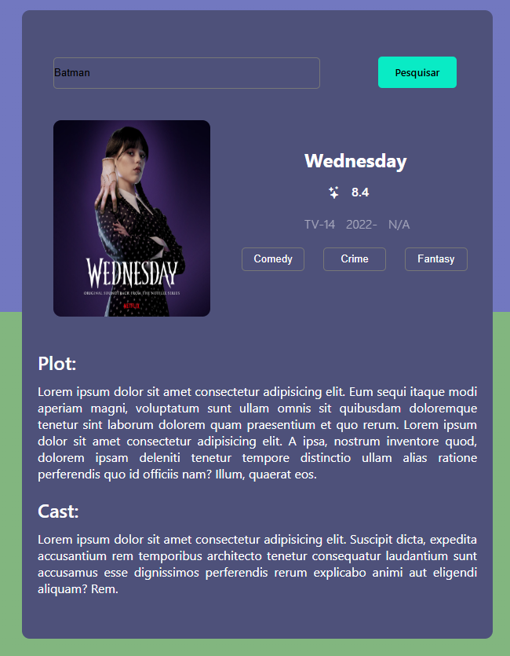

# 🎬 Filme-Secao-App
## Filme-Secao-App is a basic visual project designed to represent a simple central screen of a movie app. The main focus is to showcase the layout of a featured movie section, similar to the homepage of a streaming platform or movie catalog.

# 🧩 Purpose
## The project is not functional — it does not fetch real data or include backend logic. Its goal is to serve as a starting point or UI prototype for future development.

# 🖼️ Highlight Screen
## The main screen features:

## A poster or banner of the featured content:
### - In this case, the series "Wednesday" is displayed as a "new release".
### - A title displaying the movie/series name
### - Optional placeholder buttons like “Watch” or “Details” (depending on layout)

# 🎯 Use Case
## - Visual prototyping
## - UI/UX design exploration
## - Foundation for building a functional movie app in the future

  

